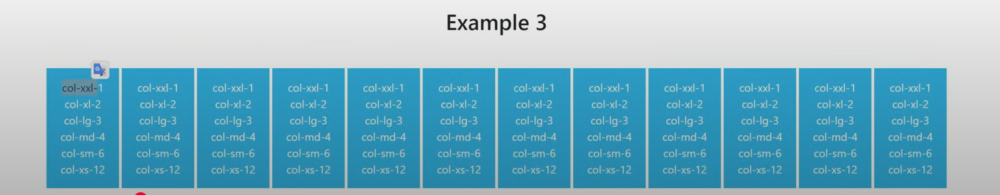
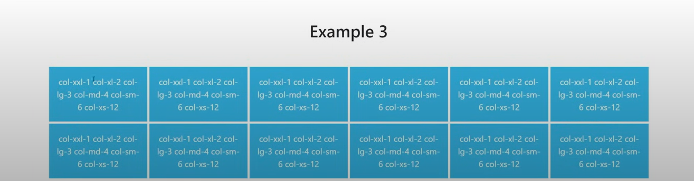
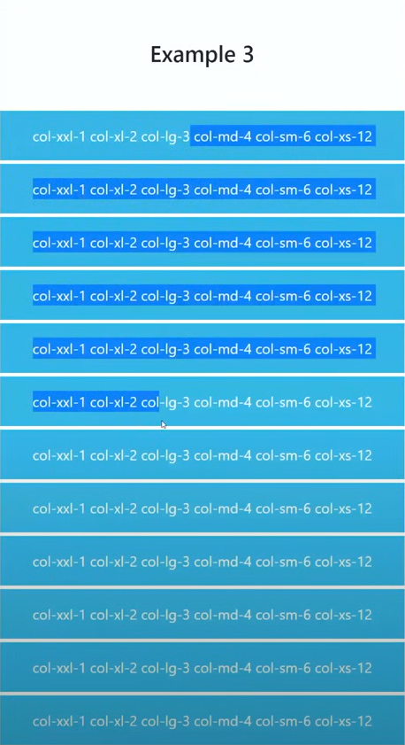

## Containers and Breakpoints in Bootstrap 5

there are 12 UNITS of horizontal columns. now these 12 will be divided accordingly to screen size according to screen size.

Above image is now in 1400 pixel above, so because of that xxl and its container will be implemented i.e. 1 unit per block therefore 12 units.

As screen size shrinks and reaches 1200px and below, xl gets activated and it's contaainer will be activated i.e. 2 units per block so 6 blocks in 1st rown and 6 blocks in second row.

As screen size shrinks and reaches 576px and below (iPhone SE size), xa gets activated and it's contaainer will be activated i.e. 12 units per block so 1 blocks in 1st rown and 1 blocks in second row and so on.

### Containers

Containers are the building blocks of Bootstrap layouts. They provide a means to center and horizontally pad your content. Bootstrap 5 offers three types of containers:

- **`.container`**: A responsive, fixed-width container that adjusts based on the current breakpoint.
- **`.container-fluid`**: A full-width container that spans the entire width of the viewport.
- **`.container-{breakpoint}`**: A responsive container that is fixed-width until the specified breakpoint, after which it becomes fluid.

### Breakpoints

Breakpoints define the responsive design thresholds in Bootstrap 5. They are based on viewport widths:

- **`xs`**: `<576px` (extra small, no specific class needed).
- **`sm`**: `≥576px`.
- **`md`**: `≥768px`.
- **`lg`**: `≥992px`.
- **`xl`**: `≥1200px`.
- **`xxl`**: `≥1400px`.

These breakpoints allow developers to create adaptive designs by applying classes specific to each range.
